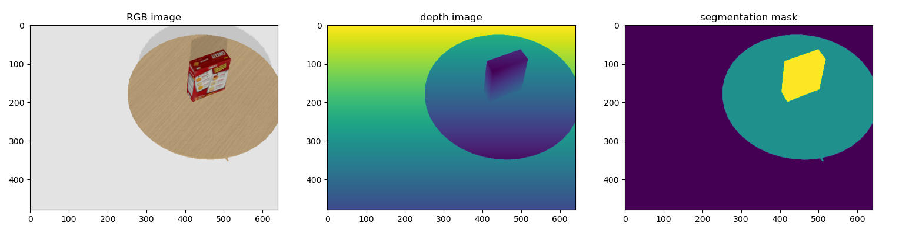

# Computer Vision (2D and 3D)

## 101 - Computer Vision Basics
### Image Transformations
<p>
  
</p>

### Back Projection
<p>
  
</p>

### Correspondences
<p align="center">
  
</p>

## 102 - Corner Detection
### Rendering from PyBullet
<p>
  
</p>

### Harris Corner Detector
<p>
  
</p>

### SIFT (Scale Invariant Feature Transform) Feature Matching
<p>
  
</p>

## 103 - CV 3D Geometry
### Epipolar Geometry
<p>
  
</p>

### Triangulation
<p>
  
</p>

### SpaceCarving
<p>
  
</p>

## 104 - Basic Neural Networks
### Gradient Descent Algorithm Implementation
### Using CIFAR-10 Dataset
<p>
  
</p>

## 105 - YOLO Object Detection
### Ground Truth vs Predicted Bounding Boxes
<p align="center">
  
</p>

### Test AP Plot
<p>
  
</p>

### Train Plot
<p>
  
</p>

### From Git Repository

```
git clone https://github.com/bharathchalla/ComputerVision.git
```

### PIP Installation

``` python
pip install -r requirements.txt
```